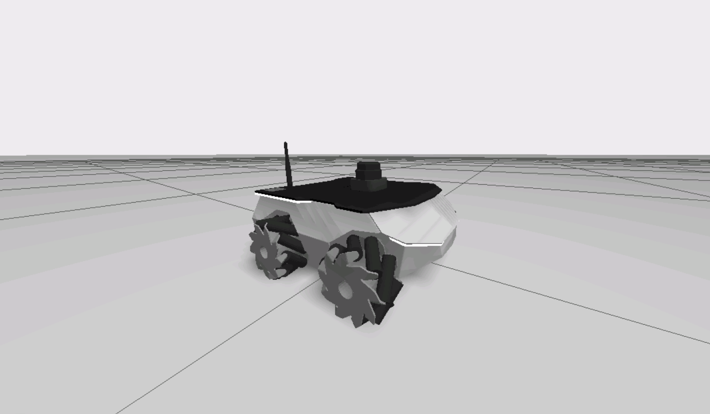
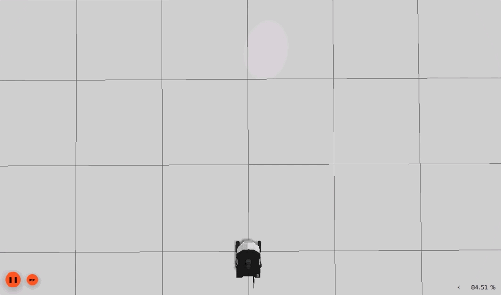
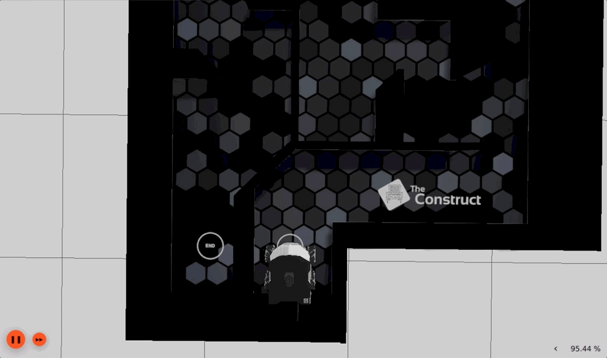
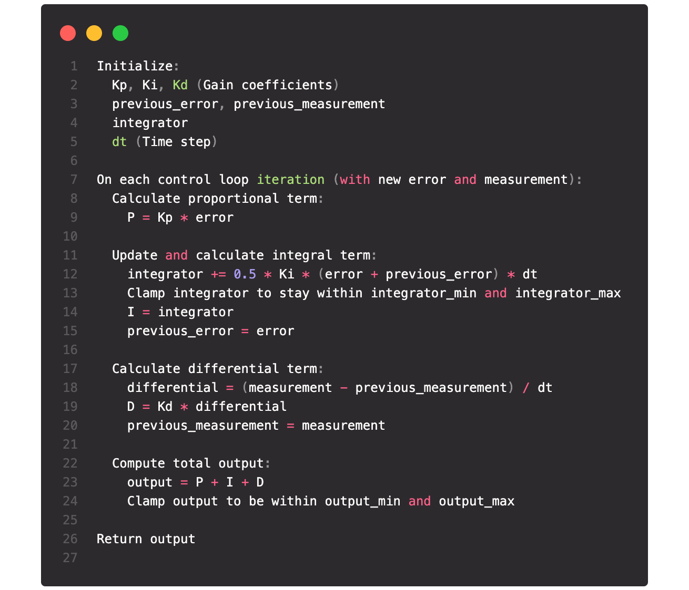

# PID Control

The aim of the project is to write a Proportional-Integral-Derivative (PID) controller which enables the `ROSbot XL` to precisely navigate and halt at designated distances and also accurately align ensuring smooth route following in complex environments.

  

## Structure

```text
.
├── distance_controller
│   ├── src
│   │   └── distance_controller.cpp
│   ├── CMakeLists.txt
│   └── package.xml
├── turn_controller
│   ├── src
│   │   └── turn_controller.cpp
│   ├── CMakeLists.txt
│   └── package.xml
└── README.md
```

## Setup

#### Distribution

Use docker for quick-start (for both ROS1 or ROS2):

```bash
# using docker for ROS1
$ docker run -ti --rm --name local-ros-noetic ros:noetic
# using docker for ROS2
$ docker run -ti --rm --name local-ros-humble ros:humble
```

#### Build (Package)

Now, create a ros2 workspace, clone the package:

```bash
# setup directory
$ mkdir ~/ros2_ws/src/
$ git clone <repo_name> ~/ros2_ws/src/
```

Install the required packages (dependency) mentioned in `package.xml` using `apt`:

```bash
# check if package is available
$ ros2 pkg list
$ ros2 node list
# update path to installed packages
$ source /opt/ros/humble/setup.bash
```

To build locally or inside docker use the following commands:

```bash
# execute build
$ cd ~/ros2_ws && colcon build
$ source ~/ros2_ws/install/setup.bash
```

## Robot

The `ROSbot XL` is an autonomous mobile robot platform featuring a robust 4x4 drive and expandable with various devices, designed for ease of use with ROS/ROS 2 software, making it perfect for educational and research applications.



**Note:** Check more details about `ROSbot XL` from [here](https://husarion.com/manuals/rosbot-xl).

## Launch

Execute `distance_controller` to move robot for waypoints at `1mt`, `2mt` and `3mt` in front of the robot.

```bash
# terminal 1
$ ros2 run distance_controller distance_controller
```



Execute `turn_controller` to turn and face for waypoints at `-45`, `0`, and `45` degree in front of the robot.

```bash
# terminal 2 (simulation)
$ ros2 run turn_controller turn_controller 1
```

```bash
# terminal 2 (real)
$ ros2 run turn_controller turn_controller 2
```



## Specifications

#### Proportional Integral Derivative Control

PID control, or Proportional-Integral-Derivative control, is a widely used feedback loop mechanism that dynamically adjusts system outputs to converge on a desired setpoint in systems ranging from industrial processes to autonomous vehicles.



## Roadmap

- [x] Preliminary Task: Acquire the Waypoint Coordinates
- [x] Part 1: Write a PID controller to move the robot forward.
- [x] Part 2: Write a PID controller to turn the robot to face the next waypoint.
- [x] Part 3: Test everything in the CyberWorld real robot lab.

See the [open issues](https://github.com/llabhishekll/pid_control/issues) for a full list of proposed features (and known issues).

## Tools

System tool/modules used for project development.

- `Applications` : [vs-code](https://code.visualstudio.com/), [ros-extensions](https://marketplace.visualstudio.com/items?itemName=ms-iot.vscode-ros) and [docker-desktop](https://docs.docker.com/get-docker/).
- `ROS` : [ros-docker-images](https://hub.docker.com/_/ros/) (`humble`, `noetic`) or [build-source](https://www.ros.org/blog/getting-started/).

## License

Distributed under the MIT License. See `LICENSE.txt` for more information.
